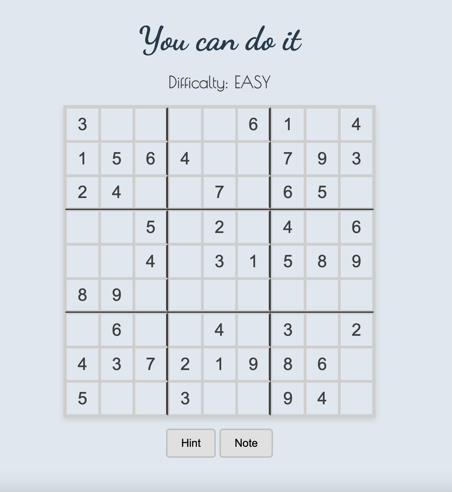

# Sudoku puzzle game

## Description:

This is a web-based Sudoku game where players can solve puzzles by filling a 9x9 grid with numbers from 1 to 9, ensuring each number appears only once in every row, column, and 3x3 subgrid. The game features three difficulty levels (Easy, Medium, Hard), hints to highlight incorrect answers, and a note-taking option for tracking possible numbers. It's a fun and challenging game designed to help improve logic and problem-solving skills.

I chose to create this game because Sudoku is both challenging and fun, offering a great way to exercise your brain. Give it a try and test your puzzle-solving skills!

### Features:

- Selectable difficulty levels (Easy, Medium, Hard).
- Interactive, color-coded grid with real-time feedback for correct and incorrect answers.
- Highlight rows and columns for better visualization of the puzzle.
- Option to take notes in empty squares to help solve the puzzle.

## Getting started:

_[Click here to try the game](http://sticky-plough.surge.sh/)_

## Attributions:

_[Suduko data set](https://huggingface.co/datasets/Ritvik19/Sudoku-Dataset?row=14)_

### user stories

1. As a user, I want to see a main page with the game and a start button, so I can begin the game easily.
2. I want to receive visual feedback that the game has started, to confirm that the game is ready to play.
3. When I click on a box to add a number, I want the selected box to be visually highlighted, so I know it's selected.
4. I want to be able to add, edit, and delete numbers in the boxes without being able to edit the numbers that are part of the original puzzle.
5. I want a hint button that lets me check if my answers are correct, with incorrect answers changing color (e.g., red) to provide immediate feedback.

#### **Extra functionalities**

1. I want the option to add notes as small numbers within a box, with a button to toggle this feature.
2. I want a clock that tracks and displays the time it takes to solve the puzzle.
3. I want sound effects that play during key events, such as when I make a move or complete the puzzle.
4. I want the game to have different difficulty levels (easy, medium, hard), so I can choose the level that best suits my skill.

## Technologies used:

- HTML, CSS, and JavaScript for creating the interactive front-end.
- Event listeners for handling user interactions, including input validation and hint toggling.

## Next step:

- Implement a **Timer** to track how long it takes to solve the puzzle.
- Add a **Dark Mode** feature for better accessibility and user experience.
- Improve **Mobile Responsiveness** to make the game more accessible on different devices.
